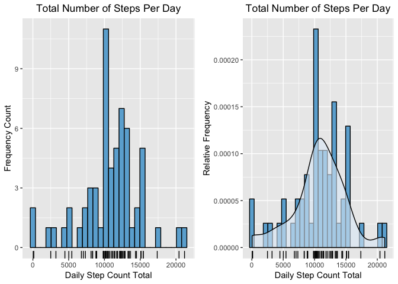

## Loading and preprocessing the data


```r
activityData <- tbl_df(read.csv(file='activity.csv', stringsAsFactors = F))

activityData$weekday <- wday(activityData$date, label = T)
```

## What is mean total number of steps taken per day?

### 1. Calculate the total number of steps taken per day


```r
dailyStats <- activityData %>% 
                group_by(date) %>%
                    summarise(dayTotal = sum(steps, na.rm = T))

cat(c('Total number of steps per day: ', dailyStats$dayTotal))
```

```
## Total number of steps per day:  0 126 11352 12116 13294 15420 11015 0 12811 9900 10304 17382 12426 15098 10139 15084 13452 10056 11829 10395 8821 13460 8918 8355 2492 6778 10119 11458 5018 9819 15414 0 10600 10571 0 10439 8334 12883 3219 0 0 12608 10765 7336 0 41 5441 14339 15110 8841 4472 12787 20427 21194 14478 11834 11162 13646 10183 7047 0
```

### 2. Make a histogram of the total number of steps taken each day

```r
ggplot(data = dailyStats, aes(x = dayTotal)) + 
    geom_histogram(color = "black", fill = blues9[3], bins = 30) + 
    labs(x = "Daily Step Count Total", y = "Frequency Count") +
    labs(title = "Total Number of Steps Per Day") +
    theme(plot.title = element_text(hjust=0.5)) +
    geom_rug() 
```


### 3. Calculate and report the mean and median of the total number of steps taken per day


```r
dayMean <- mean(dailyStats$dayTotal, na.rm = T)
dayMedian <- median(dailyStats$dayTotal, na.rm = T)

cat(c('Daily Mean is: ', dayMean))  
```

```
## Daily Mean is:  9354.22950819672
```

```r
cat(c('Daily Median is: ', dayMedian))
```

```
## Daily Median is:  10395
```


## What is the average daily activity pattern?

### 1. Make a time series plot of the 5-minute interval (x-axis) and the average number of steps taken, averaged across all days (y-axis)  


```r
intervalStats <- activityData %>% 
    group_by(interval) %>%
    summarise(intervalMean = mean(steps, na.rm = T))

ggplot(data = intervalStats, aes(x = interval, y = intervalMean)) + 
    geom_line() +
    labs(x = "Time Interval", y = "Average Step Count") +
    labs(title = "Average Number of Steps per 5 Minute Interval") +
    theme(plot.title = element_text(hjust=0.5)) 
```


### 2. Which 5-minute interval, on average across all the days in the dataset, contains the maximum number of steps?  


```r
intervalMax <- max(intervalStats$intervalMean)
peakInterval <- intervalStats$interval[intervalStats$intervalMean == intervalMax]

cat(c('The 5 minute interval with the maximum number steps averages across all days in the dataset is :', peakInterval))
```

```
## The 5 minute interval with the maximum number steps averages across all days in the dataset is : 835
```

 

## Imputing missing values

Note that there are a number of days/intervals where there are missing values (coded as NA). The presence of missing days may introduce bias into some calculations or summaries of the data.

### 1. Calculate and report the total number of missing values in the dataset (i.e. the total number of rows with NAs)


```r
NACount <- sum(is.na(activityData$steps))

cat('The number of missing values is: ', NACount)
```

```
## The number of missing values is:  2304
```


### 2. Devise a strategy for filling in all of the missing values in the dataset. 

The strategy for imputing the missing data will be to substitute NA values with the mean value calculated for the same day of the week and 5-minute interval.

### 3. Create a new dataset that is equal to the original dataset but with the missing data filled in.


```r
imputeValues <- activityData %>% 
    group_by(weekday, interval) %>%
    summarise(intervalMean = mean(steps, na.rm = T))

# find indices of the missing values
missingIndex <- which(is.na(activityData$steps))

# lookup the corresponding day and interval
missingKeys <- activityData[missingIndex,]

# create the array of replacement values
replacementValues <- rep(0,nrow(missingKeys))

for(i in seq(1:nrow(missingKeys))) {
    #int <- missingKeys[i,"interval"]
    replacementValues[i] <- imputeValues[imputeValues$weekday == missingKeys[i,"weekday"]$weekday & 
                                         imputeValues$interval == missingKeys[i,"interval"]$interval, ]$intervalMean
}
# loop over the missing values and replace NA with the imputed values
a <- replace(x = activityData$steps, list = missingIndex, replacementValues)
activityData$newsteps <- replace(x = activityData$steps, list = missingIndex, as.integer(replacementValues))
```

### 4. Make a histogram of the total number of steps taken each day and Calculate and report the mean and median total number of steps taken per day. Do these values differ from the estimates from the first part of the assignment? What is the impact of imputing missing data on the estimates of the total daily number of steps?


```r
dailyStats2 <- activityData %>% 
    group_by(date) %>%
    summarise(dayTotal = sum(newsteps, na.rm = T))


# Find the mean and median number of steps taken per day
dayMean2 <- mean(dailyStats2$dayTotal, na.rm = T)
dayMedian2 <- median(dailyStats2$dayTotal, na.rm = T)


# plot daily totals histogram 
ggplot(data = dailyStats2, aes(x = dayTotal)) + 
    geom_histogram(color = "black", fill = blues9[3], bins = 30) + 
    labs(x = "Daily Step Count Total", y = "Frequency Count") +
    labs(title = "Total Number of Steps Per Day") +
    theme(plot.title = element_text(hjust=0.5)) +
    geom_rug() 
```



```r
cat(c('Daily Mean is: ', dayMean2)) 
```

```
## Daily Mean is:  10809.7868852459
```

```r
cat(c('Daily Median is: ', dayMedian2))
```

```
## Daily Median is:  11015
```

```r
cat(c('Difference between mean using imputed values and original mean is: ', dayMean2 - dayMean))
```

```
## Difference between mean using imputed values and original mean is:  1455.55737704918
```

```r
cat(c('Difference between median using imputed values and original median is: ', dayMedian2 - dayMedian))
```

```
## Difference between median using imputed values and original median is:  620
```

   

## Are there differences in activity patterns between weekdays and weekends?


```r
activityData$weekend <- factor(activityData$weekday == 'Sat' | activityData$weekday == 'Sun', labels = c('weekday','weekend'))

intervalStats <- activityData %>% 
    group_by(weekend, interval) %>%
    summarise(intervalMean = mean(steps, na.rm = T))

#plot average steps against time interval

ggplot(data = intervalStats, aes(x = interval, y = intervalMean)) + 
    geom_line() +
    facet_grid(weekend ~ .) +
    labs(x = "Time Interval", y = "Average Step Count") +
    labs(title = "Average Number of Steps per 5 Minute Interval") +
    theme(plot.title = element_text(hjust=0.5)) 
```


