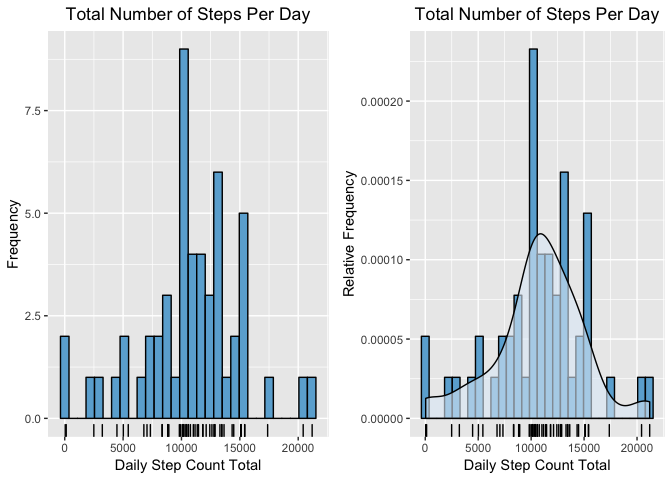

## Loading and preprocessing the data


```r
activityData <- tbl_df(read.csv(file='activity.csv', stringsAsFactors = F))

activityData$weekday <- wday(activityData$date, label = T)
```

## What is mean total number of steps taken per day?

#### 1. Calculate the total number of steps taken per day


```r
dailyStats <- activityData %>% 
                group_by(date) %>%
                    filter(!is.na(steps)) %>%
                        summarise(dayTotal = sum(steps, na.rm = T))

summary(dailyStats)
```

```
##      date              dayTotal    
##  Length:53          Min.   :   41  
##  Class :character   1st Qu.: 8841  
##  Mode  :character   Median :10765  
##                     Mean   :10766  
##                     3rd Qu.:13294  
##                     Max.   :21194
```
  

#### 2. Make a histogram of the total number of steps taken each day

```r
g1 <- ggplot(data = dailyStats, aes(x = dayTotal)) + 
    geom_histogram(color = "black", fill = blues9[5], bins = 30) + 
    labs(x = "Daily Step Count Total", y = "Frequency") +
    labs(title = "Total Number of Steps Per Day") +
    theme(plot.title = element_text(hjust=0.5)) +
    geom_rug() 

g2 <- ggplot(data = dailyStats, aes(x = dayTotal)) + 
    geom_histogram(color = "black", fill = blues9[5], bins = 30, aes(y = ..density..)) +
    geom_density(alpha=0.6, fill = blues9[2]) +
    labs(x = "Daily Step Count Total", y = "Relative Frequency") +
    labs(title = "Total Number of Steps Per Day") +
    theme(plot.title = element_text(hjust=0.5)) +
    geom_rug() 

grid.arrange(g1, g2, nrow = 1)
```

<!-- -->
  
  
#### 3. Calculate and report the mean and median of the total number of steps taken per day


```r
dayMean <- mean(dailyStats$dayTotal, na.rm = T)
dayMedian <- median(dailyStats$dayTotal, na.rm = T)
```

Daily Mean is: 10766.19  
Daily Median is: 10765
  

## What is the average daily activity pattern?

#### 1. Make a time series plot of the 5-minute interval (x-axis) and the average number of steps taken, averaged across all days (y-axis)  


```r
intervalStats <- activityData %>% 
    group_by(interval) %>%
        filter(!is.na(steps)) %>%
            summarise(intervalMean = mean(steps, na.rm = T))

ggplot(data = intervalStats, aes(x = interval, y = intervalMean)) + 
    geom_line() +
    labs(x = "Time Interval", y = "Average Step Count") +
    labs(title = "Average Number of Steps per 5 Minute Interval") +
    theme(plot.title = element_text(hjust=0.5)) 
```

<!-- -->
  
  
#### 2. Which 5-minute interval, on average across all the days in the dataset, contains the maximum number of steps?  


```r
intervalMax <- max(intervalStats$intervalMean)
peakInterval <- intervalStats$interval[intervalStats$intervalMean == intervalMax]
```

The 5 minute interval with the maximum number steps averages across all days in the dataset is : 835
   

### Imputing missing values

Note that there are a number of days/intervals where there are missing values (coded as NA). The presence of missing days may introduce bias into some calculations or summaries of the data.

#### 1. Calculate and report the total number of missing values in the dataset (i.e. the total number of rows with NAs)


```r
NACount <- sum(is.na(activityData$steps))
```
The number of missing values is: 2304


  
#### 2. Devise a strategy for filling in all of the missing values in the dataset. 

The strategy for imputing the missing data will be to substitute NA values with the mean value calculated for the same day of the week and 5-minute interval.
  
#### 3. Create a new dataset that is equal to the original dataset but with the missing data filled in.


```r
imputeValues <- activityData %>% 
    group_by(weekday, interval) %>%
        filter(!is.na(steps)) %>%
            summarise(intervalMean = mean(steps, na.rm = T))

# find indices of the missing values
missingIndex <- which(is.na(activityData$steps))

# lookup the corresponding day and interval
missingKeys <- activityData[missingIndex,]

# create the array of replacement values
replacementValues <- rep(0,nrow(missingKeys))

for(i in seq(1:nrow(missingKeys))) {
    #int <- missingKeys[i,"interval"]
    replacementValues[i] <- imputeValues[imputeValues$weekday == missingKeys[i,"weekday"]$weekday & 
                                         imputeValues$interval == missingKeys[i,"interval"]$interval, ]$intervalMean
}

# loop over the missing values and replace NA with the imputed values
a <- replace(x = activityData$steps, list = missingIndex, replacementValues)
activityData$newsteps <- replace(x = activityData$steps, list = missingIndex, as.integer(replacementValues))
```
  
  
#### 4. Make a histogram of the total number of steps taken each day and Calculate and report the mean and median total number of steps taken per day. Do these values differ from the estimates from the first part of the assignment? What is the impact of imputing missing data on the estimates of the total daily number of steps?


```r
dailyStats2 <- activityData %>% 
    group_by(date) %>%
            summarise(dayTotal = sum(newsteps, na.rm = T))


# Find the mean and median number of steps taken per day
dayMean2 <- mean(dailyStats2$dayTotal, na.rm = T)
dayMedian2 <- median(dailyStats2$dayTotal, na.rm = T)


# plot daily totals histogram 
g1 <- ggplot(data = dailyStats2, aes(x = dayTotal)) + 
    geom_histogram(color = "black", fill = blues9[5], bins = 30) + 
    labs(x = "Daily Step Count Total", y = "Frequency Count") +
    labs(title = "Total Number of Steps Per Day") +
    theme(plot.title = element_text(hjust=0.5)) +
    geom_rug() 

g2 <- ggplot(data = dailyStats, aes(x = dayTotal)) + 
    geom_histogram(color = "black", fill = blues9[5], bins = 30, aes(y = ..density..)) +
    geom_density(alpha=0.6, fill = blues9[2]) +
    labs(x = "Daily Step Count Total", y = "Relative Frequency") +
    labs(title = "Total Number of Steps Per Day") +
    theme(plot.title = element_text(hjust=0.5)) +
    geom_rug() 

grid.arrange(g1, g2, nrow = 1)
```

<!-- -->

```r
meanDiff <- dayMean2 - dayMean
medianDiff <- dayMedian2 - dayMedian
```

New Daily Mean is: 10809.79
New Daily Median is: 11015  
    
The difference between the mean using imputed values and original mean is: `meanDiff`  
The difference between the median using imputed values and original median is: 250  
  
  
   

## Are there differences in activity patterns between weekdays and weekends?

#### 1. Create a new factor variable in the dataset with two levels – “weekday” and “weekend” indicating whether a given date is a weekday or weekend day.


```r
activityData$weekend <- factor(activityData$weekday == 'Sat' | activityData$weekday == 'Sun', labels = c('weekday','weekend'))
```
  
  
#### 2. Make a panel plot containing a time series plot  of the 5-minute interval (x-axis) and the average number of steps taken, averaged across all weekday days or weekend days (y-axis). See the README file in the GitHub repository to see an example of what this plot should look like using simulated data.


```r
intervalStats <- activityData %>% 
    group_by(weekend, interval) %>%
            summarise(intervalMean = mean(newsteps, na.rm = T))

#plot average steps against time interval

ggplot(data = intervalStats, aes(x = interval, y = intervalMean)) + 
    geom_line() +
    facet_grid(weekend ~ .) +
    labs(x = "Time Interval", y = "Average Step Count") +
    labs(title = "Average Number of Steps per 5 Minute Interval") +
    theme(plot.title = element_text(hjust=0.5)) 
```

<!-- -->

```r
weekdayStats <- subset(intervalStats, weekend == 'weekday')
weekdayMax <- max(weekdayStats$intervalMean)
weekdayPeakInterval <- weekdayStats$interval[weekdayStats$intervalMean == weekdayMax]

weekendStats <- subset(intervalStats, weekend == 'weekend')
weekendMax <- max(weekendStats$intervalMean)
weekendPeakInterval <- weekendStats$interval[weekendStats$intervalMean == weekendMax]
```


The peak activity interval for weekdays is 835 with an average step count of 236.96  
The peak activity interval for weekends is 915 with an average step count of 174.94   

